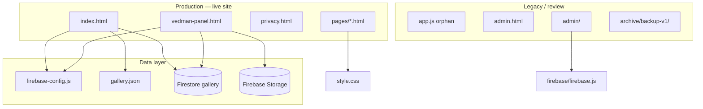

# VEDMAN — Project Map

**Version:** V4 (production) → V5 (in development)  
**Branch:** `v5-dev`  
**Domain:** `vedman.lv` (GitHub Pages + `CNAME`)  
**Last mapped:** 2026-07-03  
**Sources:** Full repo scan + `DEPENDENCY_REPORT.md` + post–Phase 1A layout

---

## Architecture overview



---

## 1. Pages and purpose

| URL path | File | Purpose | Production? | Risk |
|----------|------|---------|-------------|------|
| `/` | `index.html` | Main single-page site: hero, materials, services, gallery, quote modal, contact footer | **Yes** | Critical |
| `/vedman-panel.html` | `vedman-panel.html` | Firebase gallery admin (upload, list, delete) | **Yes** | Critical |
| `/privacy.html` | `privacy.html` | Privacy policy (GDPR-style stub) | **Yes** | Medium |
| `/pages/grants.html` | `pages/grants.html` | SEO stub — grants keyword landing | Stub | Medium |
| `/pages/kontakti.html` | `pages/kontakti.html` | SEO stub — contacts | Stub | Medium |
| `/pages/manipulators.html` | `pages/manipulators.html` | SEO stub — manipulator services | Stub | Medium |
| `/pages/materiali.html` | `pages/materiali.html` | SEO stub — materials (no sitemap entry) | Stub | Low |
| `/pages/melnzeme.html` | `pages/melnzeme.html` | SEO stub — melnzeme | Stub | Medium |
| `/pages/objekti.html` | `pages/objekti.html` | SEO stub — projects (no sitemap entry) | Stub | Low |
| `/pages/pakalpojumi.html` | `pages/pakalpojumi.html` | SEO stub — services (no sitemap entry) | Stub | Low |
| `/pages/skembas.html` | `pages/skembas.html` | SEO stub — šķembas | Stub | Medium |
| `/pages/smilts.html` | `pages/smilts.html` | SEO stub — smilts | Stub | Medium |
| `/admin.html` | `admin.html` | Legacy GitHub + `gallery.json` editor (localStorage) | Superseded | Low |
| `/admin/login.html` | `admin/login.html` | Firebase Auth login (placeholder config) | Broken | Low |
| `/admin/admin.html` | `admin/admin.html` | Legacy Firebase object upload form | Broken | Low |
| `/archive/backup-v1/*` | `archive/backup-v1/` | V1 multi-page HTML snapshot (archived Phase 1A) | Archive | Low |

**Improvement:** Unify SEO strategy — either merge `pages/` into V5 design or noindex stubs until content is real.

---

## 2. Scripts and load map

| Script | Loaded by | Load type | Functions / role | Dependencies | Risk | Recommendation |
|--------|-----------|-----------|------------------|--------------|------|----------------|
| **Inline `<script>`** | `index.html:708–860` | Inline | `DATA`, `fillMain`, `updateSub`, `openQuote`, qty/unit/addon handlers, `calcM3`, WhatsApp send, `loadGallery()` | `gallery.json`, DOM ids | Critical | Extract to module in V5; keep inline until UI phase |
| **Inline ES module** | `index.html:863–902` | `type="module"` | `window.loadFirebaseGallery()` — Firestore read, tab render | `firebase-config.js`, Firebase CDN 10.12.5 | Critical | Add error UI; keep fallback chain |
| **`firebase-config.js`** | `index.html:862`, `vedman-panel.html:79` | `<script src>` | Sets `window.VEDMAN_FIREBASE_CONFIG`, `VEDMAN_FIREBASE_READY` | None | Critical | Move secrets to env/build in V5; rules hardening |
| **Inline ES module** | `vedman-panel.html:81–375` | `type="module"` | Login, `initFirebasePanel`, `uploadOne`, `loadList`, delete, drag-drop | `firebase-config.js`, Firebase CDN 10.12.5 | Critical | Replace client login with Firebase Auth |
| **Inline `<script>`** | `admin.html:28–43` | Inline | localStorage gallery JSON builder | DOM, localStorage | Low | Archive after V5 admin confirmed |
| **`admin/login.js`** | `admin/login.html` | `type="module"` | `signInWithEmailAndPassword` → redirect | `firebase/firebase.js`, Firebase Auth 10.8.0 | Low | Archive or wire to real config |
| **`admin/admin.js`** | `admin/admin.html` | `type="module"` | Auth guard, multi-image upload to `objects/` | `firebase/firebase.js`, Storage, Firestore | Low | Archive |
| **`firebase/firebase.js`** | `admin/login.js`, `admin/admin.js` | ES `import` | Exports `auth`, `db`, `storage` — **placeholder `XXXX` config** | Firebase CDN 10.8.0 | Low | Remove after archiving `admin/` |
| **`app.js`** | *(none — not loaded)* | — | Quote modal, calculator, filters — duplicate of older `style.css` UI | Expects DOM from unused V2.5 layout | Low | Archive or delete in later phase |
| **`archive/backup-v1/nav.js`** | Archived HTML via `js/nav.js` (broken path) | Would be `<script src>` | Nav renderer, order form, i18n LV/RU/EN | Missing `css/style.css` | Low | Reference only; do not deploy |

**External scripts (CDN):**

| Source | Used in |
|--------|---------|
| `fonts.googleapis.com` (Inter) | `index.html` |
| `gstatic.com/firebasejs/10.12.5/*` | `index.html`, `vedman-panel.html` |
| `gstatic.com/firebasejs/10.8.0/*` | `firebase/firebase.js`, `admin/*` |

---

## 3. CSS files and usage

| File | Used by | Scope | Risk | Recommendation |
|------|---------|-------|------|----------------|
| **`index.html` inline `<style>`** | `index.html` only | Full V4 design system (~550 lines) | Critical | Source of truth for homepage until V5 refactor |
| **`style.css`** | All 9 `pages/*.html`, `admin/login.html`, `admin/admin.html` | V2.5 design (Inter, quote modal classes, responsive) | Medium | Merge or replace when `pages/` redesigned |
| **`vedman-panel.html` inline `<style>`** | Panel only | Admin UI | Medium | OK isolated |
| **`admin.html` inline `<style>`** | Legacy admin | Minimal card layout | Low | Archive |
| **`privacy.html` inline `<style>`** | Privacy page | Minimal prose layout | Low | OK |
| **Google Fonts CSS** | `index.html`, archived backup pages | Typography | Low | Self-host optional |

**Not used:** `style.css` is **not** linked from `index.html`. Homepage and subpages use different design systems.

---

## 4. Firebase usage

### 4.1 Configuration

| File | Project | SDK | Role |
|------|---------|-----|------|
| `firebase-config.js` | `vedman-lv` | N/A (config object) | **Production** — live API keys |
| `firebase/firebase.js` | Placeholder `XXXX` | 10.8.0 | **Non-production** — `admin/` only |
| `FIREBASE_RULES.txt` | Console rules | — | Open read/write (deployed manually) |
| `FIREBASE_RULES_SECURE_NEXT.txt` | Planned | — | Auth-gated writes |

### 4.2 Production Firebase flows

| Feature | File | Function | Firestore | Storage | Risk | Recommendation |
|---------|------|----------|-----------|---------|------|----------------|
| **Gallery read (public)** | `index.html` | `loadFirebaseGallery()` | `collection("gallery")` ordered by `createdAt` | Read URLs from docs | Medium | OK; add pagination if gallery grows |
| **Gallery upload** | `vedman-panel.html` | `uploadOne()` | `addDoc(gallery, {...})` | `{category}/{filename}.webp` | **High** | Secure rules + real auth |
| **Gallery list** | `vedman-panel.html` | `loadList()` | `getDocs(query(...))` | — | Medium | OK |
| **Gallery delete** | `vedman-panel.html` | delete button handler | `deleteDoc` | `deleteObject` | **High** | Require auth in rules |
| **Panel init** | `vedman-panel.html` | `initFirebasePanel()` | — | `getStorage`, `getFirestore` | Critical | OK |

### 4.3 Legacy Firebase flows (non-production)

| Feature | File | Collection | Storage path | Status |
|---------|------|------------|--------------|--------|
| Email login | `admin/login.js` | — | — | Broken (XXXX config) |
| Object upload | `admin/admin.js` | `objects` | `objects/{timestamp}-{name}` | Broken |

### 4.4 Document schema (Firestore `gallery`)

Fields written by panel: `category`, `title`, `description`, `url`, `path`, `type`, `originalName`, `sizeOriginal`, `sizeOptimized`, `createdAt`.

---

## 5. Forms

| Form / UI | File | Submit behavior | Fields | Risk | Recommendation |
|-----------|------|-----------------|--------|------|----------------|
| **Quote modal** | `index.html` `#quoteModal` | `#sendBtn` click → validates → `window.open(wa.me/...)` | Material, fraction, amount, unit, address, addons, name, phone, comment | Low | Add client-side phone validation; server not involved |
| **Volume calculator** | `index.html` (inside modal) | `#applyCalc` → sets `#amount` | length, width, depth (cm) | Low | OK |
| **Admin login** | `vedman-panel.html` `#login` | `#loginBtn` / Enter → `doLogin()` | username, password | **Critical** | Replace with Firebase Auth; remove hardcoded creds |
| **Upload form** | `vedman-panel.html` `#app` | `#uploadBtn` → Firebase upload | category, title, description, files | **High** | Protect with auth + rules |
| **Legacy gallery builder** | `admin.html` | Buttons only (no HTTP POST) | category, filename, title, description | Low | Archive |
| **Firebase Auth login** | `admin/login.html` `#loginForm` | `login.js` submit | email, password | Medium | Archive |
| **Object form** | `admin/admin.html` `#objectForm` | `admin.js` submit | title, category, city, description, images | Low | Archive |
| **Order form (archived)** | `archive/backup-v1/nav.js` | Injected modal submit | material, qty, address, etc. | Low | Reference only |

No form posts to a backend — all lead capture goes to **WhatsApp**.

---

## 6. Buttons and CTAs

### 6.1 `index.html` (production)

| Element | Class / selector | Action | Risk |
|---------|------------------|--------|------|
| Header CTA | `.js-open` | Opens quote modal | Low |
| Hero CTAs | `.js-open`, `tel:`, `wa.me` | Modal / call / WhatsApp | Low |
| Service strip tabs | `.service-tab[data-material]` | Opens modal with preset material | Low |
| Material chips | `.chip[data-material][data-sub]` | Opens modal with preset fraction | Low |
| Material cards | `.mat-card-btn.js-open` | Opens modal | Low |
| CTA strip | `.cta-item` tel / wa / `.js-open` | Call, WhatsApp, modal | Low |
| Mobile bar | `.bottom-bar` | Call, modal, WhatsApp | Low |
| Modal close | `#closeModal` | Closes modal | Low |
| Qty +/- | `#plusBtn`, `#minusBtn` | Adjust amount ±1 | Low |
| Fine step | `#finePlus`, `#fineMinus` | Adjust ±0.1 | Low |
| Unit cards | `.unit-card[data-unit]` | Set m³ or tonnas | Low |
| Addons | `.addon[data-extra]` | Toggle extras for WhatsApp msg | Low |
| Calc toggle | `#calcToggle` | Show/hide m³ calculator | Low |
| Apply calc | `#applyCalc` | Copy calc result to amount | Low |
| Send | `#sendBtn` | Build WhatsApp message | Low |
| Admin square | `.admin-square` | Navigate to `vedman-panel.html` | Medium |
| Nav anchors | `#materiali`, `#pakalpojumi`, etc. | In-page scroll | Low |
| Privacy link | `privacy.html` | Legal page | Low |

### 6.2 Other pages

| Page | CTAs |
|------|------|
| `pages/*.html` | Back to `../index.html#materiali`, WhatsApp, phone in header |
| `vedman-panel.html` | Login, upload, refresh, delete per item, back to index |
| `privacy.html` | Back link to `/` |

**Improvement:** Track CTA clicks consistently (partial `trackEvent` exists only in unused `app.js`).

---

## 7. Calculators

| Calculator | File | Function | Formula | Loaded? | Risk | Recommendation |
|------------|------|----------|---------|---------|------|----------------|
| **m³ volume (production)** | `index.html:783–797` | `calcM3()`, `applyCalc` | `L × W × (depth_cm / 100)` | **Yes** | Low | Keep; add input validation max bounds |
| **m³ volume (orphan)** | `app.js:125–161` | `calcVolume()`, `calcApply` | Same formula, different DOM ids | **No** | Low | Remove duplicate when archiving `app.js` |
| **Price estimate (archived)** | `archive/backup-v1/smilts.html` | `kalkCalc()` | `m³ × material_rate + zone_fee` | Archive only | Low | Do not restore without price governance |

---

## 8. Gallery logic

### 8.1 Load order (`index.html`)

```
loadGallery() called on page load
  1. Try window.loadFirebaseGallery()  → Firestore
  2. Else fetch("gallery.json")        → static fallback
  3. Else show error mentioning admin.html
```

| Function | File | Lines | Behavior |
|----------|------|-------|----------|
| `loadGallery()` | `index.html` | 837–857 | Orchestrates Firebase-first fallback |
| `loadFirebaseGallery()` | `index.html` | 867–897 | Reads Firestore; builds filter tabs; renders cards with `${i.url}` |
| Fallback JSON loader | `index.html` | 843–853 | Uses `data.categories`, `data.items`; images via `${i.src}` |

### 8.2 `gallery.json` (fallback)

| Field | Value |
|-------|-------|
| `categories` | 10 category definitions (ids match panel categories mostly) |
| `items` | `[]` empty — no static gallery items |
| Expected item shape | `{ category, src, title, description }` where `src` is local path e.g. `gallery/grants/file.jpg` |

**Note:** No `/gallery/` folder exists in repo; JSON fallback would show empty or broken images if Firebase fails.

### 8.3 Admin gallery (`vedman-panel.html`)

| Step | Function | Details |
|------|----------|---------|
| Compress | `imageToWebp()` | Canvas → WebP max 1600px, q=0.8 |
| Upload | `uploadOne()` | Storage path + Firestore metadata |
| List | `loadList()` | Newest first |
| Delete | click handler | Firestore doc + Storage object |

| Risk | Issue | Recommendation |
|------|-------|----------------|
| **High** | Open Firebase rules allow public writes | Apply `FIREBASE_RULES_SECURE_NEXT.txt` |
| Medium | Client-only admin gate | Firebase Auth |
| Low | Category list differs slightly from `gallery.json` | Sync category enums in V5 |

---

## 9. Admin / login logic

| System | File | Auth mechanism | Session | Production? | Risk |
|--------|------|----------------|---------|-------------|------|
| **VEDMAN Panel** | `vedman-panel.html` | Hardcoded `ADMIN_USER` / `ADMIN_PASS` in JS | `sessionStorage.vedmanAdmin` | **Yes** | **Critical** |
| Legacy JSON admin | `admin.html` | None | `localStorage.vedmanGalleryData` | No | Low |
| Firebase Auth admin | `admin/login.js` + `admin/admin.js` | Firebase email/password | Firebase Auth session | Broken | Medium |

### Panel login flow

1. User opens `/vedman-panel.html`
2. If `sessionStorage.vedmanAdmin === "1"` → show app, call `initFirebasePanel()`
3. Else show login form → `doLogin()` compares plaintext credentials
4. On success → init Firebase, enable upload/delete

**Security risks:** Credentials in source (`admin` / `admin123` per README), session flag trivially forgeable, Firebase rules allow unauthenticated writes.

**Recommendation:** Firebase Auth + secure rules + remove credentials from repo/README.

---

## 10. SEO files

| File | Served at | Content | Production authority | Risk | Recommendation |
|------|-----------|---------|----------------------|------|----------------|
| `robots.txt` | `/robots.txt` | Allow `/`, disallow panel, sitemap URL | **Yes** | Critical | Keep |
| `sitemap.xml` | `/sitemap.xml` | Homepage only | **Yes** | Medium | Add `/pages/*` when stubs have content |
| `index.html` | `/` | `<link rel="canonical" href="https://vedman.lv/">`, meta description | **Yes** | Medium | Add structured data in V5 |
| `pages/*.html` | `/pages/...` | Per-page `<title>`, meta description; **no canonical tags** | Partial | Medium | Add canonical + real content |
| `manifest.json` | `/manifest.json` (if requested) | PWA manifest, **empty icons[]**, not linked in HTML | Unused | Low | Wire or remove |
| `CNAME` | — | `vedman.lv` | **Yes** | Critical | Keep |
| ~~`seo/` folder~~ | — | Removed Phase 1A (stale duplicate) | — | — | — |

**Gap:** 9 SEO subpages exist but root sitemap lists only homepage — discoverability mismatch.

---

## 11. Image usage

### 11.1 Production images (actively referenced)

| File | Referenced by | Load type | Risk |
|------|---------------|-----------|------|
| `favicon.png` | `index.html:9` | static `<link rel="icon">` | Critical |
| `vedman-logo.png` | `index.html` header/footer, `vedman-panel.html`, `admin.html` | static ``, CSS `content:url()` | Critical |

### 11.2 Non-production / design assets

| File | Production refs | Purpose | Risk | Recommendation |
|------|-----------------|---------|------|----------------|
| `vedman-logo-footer.png` | None | Deprecated alternate footer logo | Low | Archive |
| `assets/vedman-logo-final.png` | None | High-res logo master (duplicate root removed Phase 1A) | Low | Keep one master in `assets/` |
| `assets/favicon.png` | None | Alternate favicon (different bytes from root) | Low | Manual review — pick one canonical |
| `assets/images/design-c-reference.png` | None | Design mockup reference | Low | Archive when V5 UI locked |
| `assets/images/hero-reference.png` | None | Hero design reference | Low | Archive when V5 UI locked |

### 11.3 Root JPEG gallery (`*.jpeg` × 30)

| Usage | Count | Referenced by |
|-------|-------|---------------|
| Archived backup HTML only | 22 | `archive/backup-v1/*.html`, `galerija.html` JS array |
| Completely unreferenced | 8 | `koku stadisana1.jpeg`, `manipul12.jpeg`, `melnz10–12.jpeg`, `zari7–8.jpeg` |

**Production gallery images:** Loaded dynamically from **Firebase Storage URLs** (`${i.url}`) or from **`gallery.json` item `src`** paths — not from root JPEGs.

### 11.4 Dynamic image references

| Source | Template | When |
|--------|----------|------|
| Firestore | `` `` `` | Firebase gallery success |
| Firestore | `` `<video src="${i.url}">` `` | Video items |
| `gallery.json` | `` `` `` | Firebase fallback |
| `admin.html` preview | `` `` `` | Legacy admin localStorage |
| `vedman-panel.html` list | `` `` `` | Admin preview |

### 11.5 CSS-only imagery (`index.html`)

Material cards use CSS gradient classes (`.mat-img.stones`, `.sand`, `.gravel`, etc.) — **no image files**.

---

## 12. Security risks

| ID | Risk | Location | Severity | Impact | Recommendation |
|----|------|----------|----------|--------|----------------|
| S1 | Hardcoded admin credentials in JS | `vedman-panel.html:86–87`, `README.md` | **Critical** | Anyone can read source and access panel | Firebase Auth; rotate creds; remove from README |
| S2 | Trivial session gate | `vedman-panel.html` `sessionStorage` | **High** | Bypass login UI without knowing Firebase | Server-side or Firebase Auth tokens |
| S3 | Open Firestore/Storage write rules | `FIREBASE_RULES.txt` | **Critical** | Public can upload/delete gallery data | Deploy `FIREBASE_RULES_SECURE_NEXT.txt` |
| S4 | Admin URL discoverable | `index.html` footer `.admin-square`, `robots.txt` disallow only | Medium | Obscurity not security | Auth + rules; optional remove footer link |
| S5 | Firebase API key in repo | `firebase-config.js` | Low* | Expected for client apps; abuse still possible with open rules | Restrict rules; App Check in V5 |
| S6 | Placeholder config in repo | `firebase/firebase.js` | Low | Misleading if deployed | Archive file |
| S7 | Privacy page incomplete | `privacy.html` | Medium | Legal compliance gap | Add company legal details |
| S8 | No CSP / SRI | All HTML | Medium | XSS supply-chain risk on CDN | Add CSP headers via hosting config |
| S9 | WhatsApp PII in URL | Quote forms | Low | Data in browser history/logs | Accept or add server relay later |

*Firebase web API keys are public by design; risk is compounded by S3.

---

## 13. Dead / orphan files — manual review queue

| File / folder | Why orphan | Prod impact if removed | Review action | Risk |
|---------------|------------|------------------------|---------------|------|
| `app.js` | Zero `<script src>` importers | None | Archive in Phase 1B+ | Low |
| `admin.html` | Superseded by panel; mentioned in `index.html:855` text only | None on gallery if Firebase works | Archive | Low |
| `admin/` (4 files) | No link from production; broken config | None | Archive | Low |
| `firebase/firebase.js` | Only `admin/` imports; XXXX placeholders | None on live site | Archive | Low |
| `vedman-logo-footer.png` | Zero HTML refs; README says deprecated | None | Archive | Low |
| `assets/favicon.png` | Zero refs; differs from root favicon | None | Pick canonical favicon | Low |
| `assets/images/*-reference.png` | Design refs only | None | Archive after V5 design | Low |
| 30× root `*.jpeg` | Zero production refs | None on live homepage | Migrate to Firebase then archive | Medium |
| `pages/materiali.html`, `objekti.html`, `pakalpojumi.html` | Not in sitemap; placeholders | SEO only | Expand or noindex | Medium |
| `manifest.json` | Not linked; empty icons | None today | Implement PWA or remove | Low |
| `archive/backup-v1/` | Archived legacy | None | Keep as history | Low |
| `TEST_REPORT.md` | Dev checklist | None | Keep for QA reference | Low |

---

## Feature index (quick reference)

| Feature | Primary file | Function(s) | Deps | Risk | V5 recommendation |
|---------|--------------|-------------|------|------|---------------------|
| Homepage | `index.html` | — | inline CSS/JS | Critical | Redesign in dedicated UI phase |
| Quote → WhatsApp | `index.html` | `openQuote`, send handler | — | Low | Keep flow; optional analytics |
| m³ calculator | `index.html` | `calcM3` | — | Low | Keep |
| Firebase gallery view | `index.html` | `loadFirebaseGallery` | Firestore, config | Critical | Pagination + skeleton UI |
| JSON gallery fallback | `index.html` | `loadGallery` | `gallery.json` | Medium | Align categories with panel |
| Gallery admin | `vedman-panel.html` | upload/list/delete | Firebase | Critical | Auth + secure rules |
| SEO stubs | `pages/*.html` | — | `style.css` | Medium | Content + sitemap |
| Privacy | `privacy.html` | — | — | Medium | Legal review |
| Legacy JSON admin | `admin.html` | localStorage CRUD | — | Low | Archive |

---

## Related documents

| Document | Purpose |
|----------|---------|
| `CLEANUP_PLAN.md` | Phased cleanup strategy |
| `DEPENDENCY_REPORT.md` | Reference graph (Phase 0.5) |
| `CLEANUP_PHASE1_REPORT.md` | Phase 1A execution log |
| `README.md` | Firebase setup + admin URL |
| `FIREBASE_RULES*.txt` | Security rules reference |

---

**This map is documentation only. No production code was modified.**
